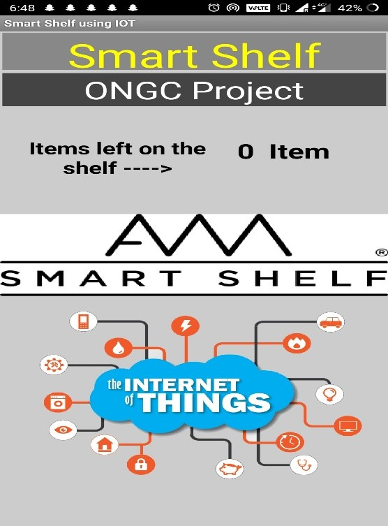

# Smart-Shelves
Aim of this project with smart shelve, business owners can collect real-time data about their product. The shelves are able to show what product have or haven’t been taken and update with information about products as soon as they are removed. The smart shelves provide retailers with various ways of improving their customer service, increasing sales and reducing cart abandonment. They also trigger the back-end system about items that do not belong to certain shelves “misplace items”.

## Requirements
Hardware
•	NodeMCU Board
•	IR Sensor
•	Bread Board
•	Jumper Wires
•	USB Cable

Software
•	Arduino IDE
•	Firebase

## Procedure
In order to make the Smart Shelf run, Firstly the IR sensors plays a vital role in collecting information from the outside world, it collect the data and send it in the form of 0 and 1( 0 means empty and 1 means presence). NodeMCU acts like a transmitter which collects data and program it in Arduino IDE and send it further to translate in Human language from machine language. Then FIREBASE acts as storage database and stores and update the data in Real-time database. Now the last thing, for the making of an app, I used Android studio to design the format of the app and display the information gathered from NodeMCU.

## Basic prototype 

## Screenshot of the basic mobile application

